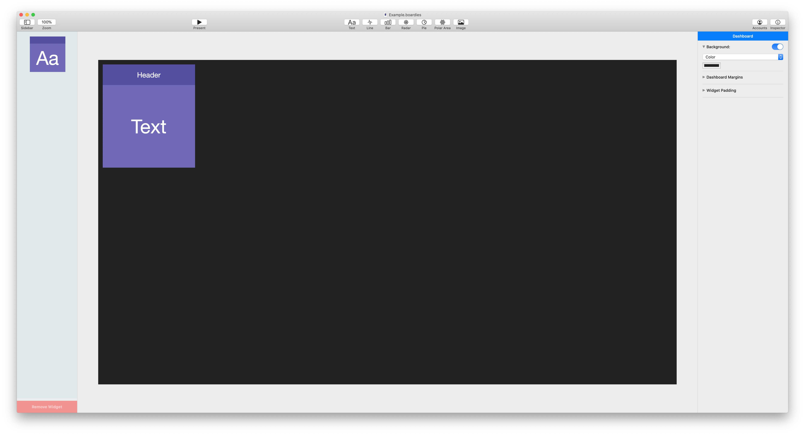
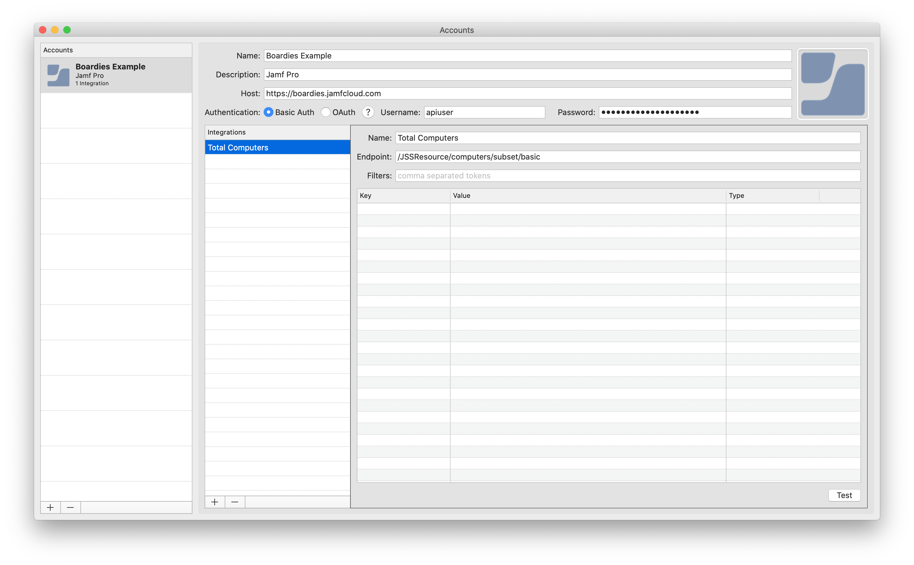
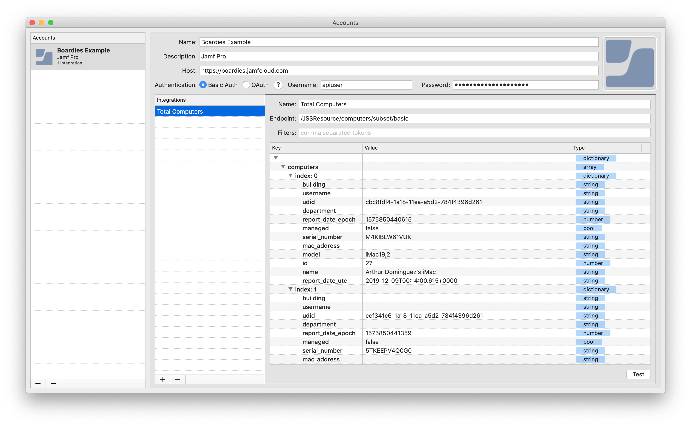

# Setting up Accounts (API Integrations)

Dashboard widgets can be configured to retrieve data from external sources that provide a [REST API](https://en.wikipedia.org/wiki/Representational_state_transfer).

Follow the steps below to setup up accounts and configure custom API integrations.

## Instructions

!!! info
    These instructions will use the **Jamf Classic API** as the example.

1.  From your Boardies document, open the Accounts window by clicking on the **Accounts** button in the toolbar:

    

1.  Click on the :fontawesome-solid-plus: button to add an Account:

    

1.  Fill in the following account information:

    *   Name
    *   Description
    *   Host: Base URL of the server you will retrieve data from
    *   Authentication: **Basic Auth** or **OAuth**
    *   Username
    *   Password: Will be OAuth token if **OAuth** was selected for Authentication

    !!! tip "Nice to have"
        Drop in a nice icon to help you distinguish between accounts!

    

1.  Click on the :fontawesome-solid-plus: button to add an Integration:

    

1.  Fill in the following integration information:

    *   Name
    *   Endpoint: See [below](#common-rest-apis) for a list of common REST APIs and endpoint documentation
    *   Filters: List of comma separated tokens to filter down retrieved data

    !!! info
        Leave the filters blank for now. They will be added in a couple of steps.

    

1.  Once all fields have been filled in, click **Test** to retrieve some data:

    

1.  Boardies will attempt to retrieve data based on the provided credentials. If everything looks good, the table will populate with results:

    

1.  In this example, we can see the results show a master dictionary containing an array of `computers`, containing dictionaries. To filter down the results, add `computers` to the **Filters**.

    Click **Test** again:

    

1.  We can now see just the filtered down `computers` array - there is no master dictionary.

    Let's filter down further. For arrays, we can filter by index. Add `0` to the **Filters**.

    Click **Test** again:

    

1.  We can now see just the first computer in the `computers` array.

    To drive the point home, add `model` to the **Filters**.

    Click **Test** again:

    

1.  We can now see just the model from the first computer in the `computers` array.

    This is a very specific example, but it illustrates how you can drill down to almost any bit of data you require.

    We will be using the **Total Computers** integration for other examples, so remove `0` and `model` from the **Filters**:

    

!!! success "Next Steps"
    *   Visit [Widgets - Text](../widgets-text) to see how you can use this API integration in a text widget.
    *   Visit [Widgets - Chart](../widgets-chart) to see how you can use this API integration in a chart widget.

&nbsp;

## Common REST APIs

|     | REST API            | Supports Basic Auth       | Supports Token Auth       | Documentation                                                               |
| :-: | :------------------ | :-----------------------: | :-----------------------: | :-------------------------------------------------------------------------: |
|     | Jamf Classic API    | :fontawesome-solid-check: | :fontawesome-solid-times: | [Link](https://www.jamf.com/developers/apis/classic/overview/)              |
|     | Jamf Pro API (Beta) | :fontawesome-solid-times: | :fontawesome-solid-check: | [Link](https://www.jamf.com/developers/apis/jamf-pro/)                      |
|     | GitHub              | :fontawesome-solid-check: | :fontawesome-solid-check: | [Link](https://developer.github.com/v3/)                                    |
|     | GitLab              | :fontawesome-solid-times: | :fontawesome-solid-check: | [Link](https://docs.gitlab.com/ce/api/)                                     |
|     | Bitbucket           | :fontawesome-solid-check: | :fontawesome-solid-check: | [Link](https://confluence.atlassian.com/bitbucket/rest-apis-222724129.html) |
|     | Mailchimp           | :fontawesome-solid-check: | :fontawesome-solid-check: | [Link](https://mailchimp.com/developer/)                                    |
