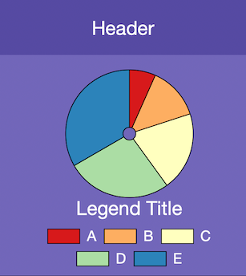

# Chart Widgets

Chart Widgets allow you to display fully-customisable charts, optionally retrieving data from a CSV file or an API Integration.

## Selecting an API Integration

!!! info
    We will be using the **Total Computers** API integration example we previously set up.

    Visit [Setting up Accounts](../accounts) to find out more about setting up an example Account and API Integration.

1.  Select a chart widget by clicking on the thumbnail in the sidebar, or on the widget itself in the dashboard section.

    !!! info
        You should see **Chart** and **Style** sections in the inspector on the right.

    

1.  In the inspector, click on the **type** drop-down and select **API Integration**:

    

1.  Select the **Boardies Example** account, and select the **Total Computers** integration:

    

1.  Charts require grouping of the retrieved data.

    Referring back to when we setup the **Total Computers** API Integration, each computer record has the following keys:

    

    To group by computer model, enter `model` in the **Key for Grouping** textfield:

    

1.  Click **Test**:

    

!!! Success
    The chart widget's API Integration has been configured successfully.
