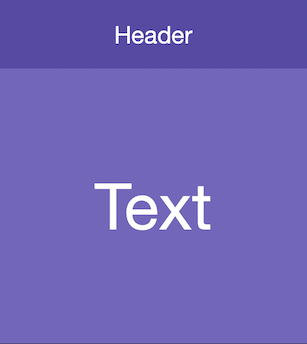

# Text Widgets

Text Widgets allow you to display fully-customisable text, optionally retrieving data from a plain text file or an API Integration.

## Selecting an API Integration

!!! info
    We will be using the **Total Computers** API integration example we previously set up.

    Visit [Setting up Accounts](../accounts) to find out more about setting up an example Account and API Integration.

1.  Select a text widget by clicking on the thumbnail in the sidebar, or on the widget itself in the dashboard section.

    !!! info
        You should see **Text** and **Style** sections in the inspector on the right.

    

1.  In the inspector, click on the **type** drop-down and select **API Integration**:

    

1.  Select the **Boardies Example** account, and select the **Total Computers** integration:

    

1.  Click **Test**:

    

    !!! warning
        We are getting output from the API Integration, however it is not in the format we want.

        The output is currently displaying data about all computers. We only care about the total count.

1.  In the inspector, ensure **Display as total count** is switched on.

    Click **Test** again:

    

!!! Success
    The text widget's API Integration has been configured successfully.
